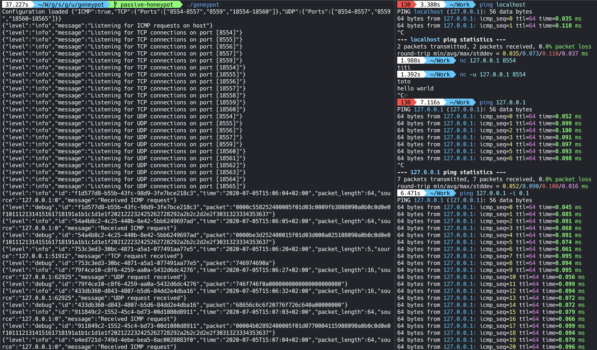

# GoneyPot

<p align="center">

</p>

A golang CLI to setup [honey pots](https://en.wikipedia.org/wiki/Honeypot_(computing)). For now, GoneyPot can only be used for setting up passive honey pots, which can't be interacted with and just listen to scans on the network.

## Features

* Listens for scanning on all TCP and UDP ports
* Detects ICMP & ping messages
* File configuration
* JSON-formatted structured logs

<p align="center">
    
</p>

## Example configuration

```yaml
debug: true # When debug mode is enabled, received packets are logged.

icmp: true # Enables ICMP ping detection.
tcp:
  ports:
    - 8554-8557 # You can specify port ranges or individual ports on which to listen.
    - 8559
    - 18554-18560
udp:
  ports:
    - 8554-8557
    - 8559
    - 18560-18565
```

## Todo

* Docker Image
* Grafana Dashboard with Prometheus Metrics
    * Prometheus reporter
    * Email alerting
* Service emulation (interactive honey pot)
* Signature-based intrusion detection
    * Severity levels
